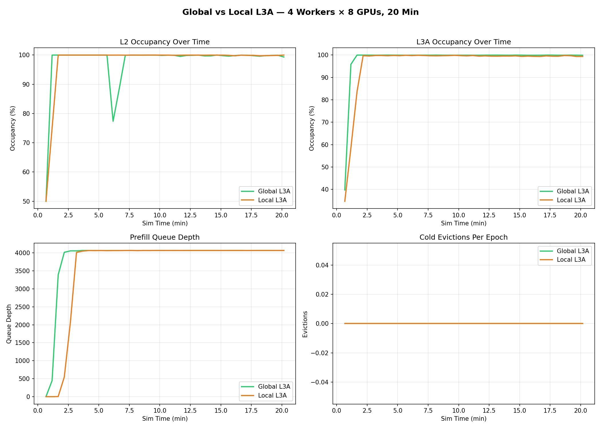
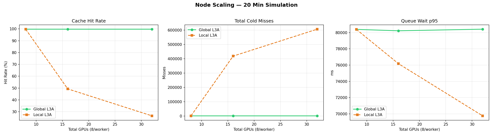
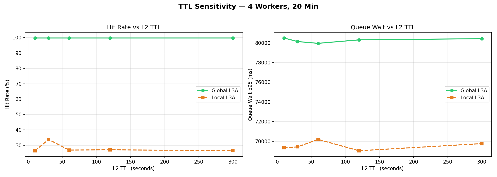
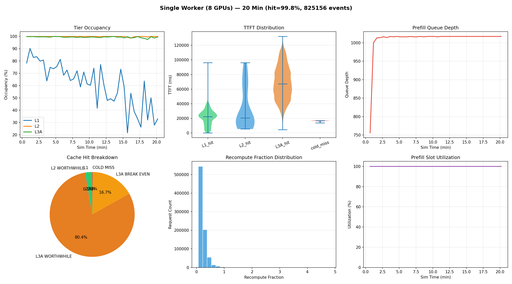
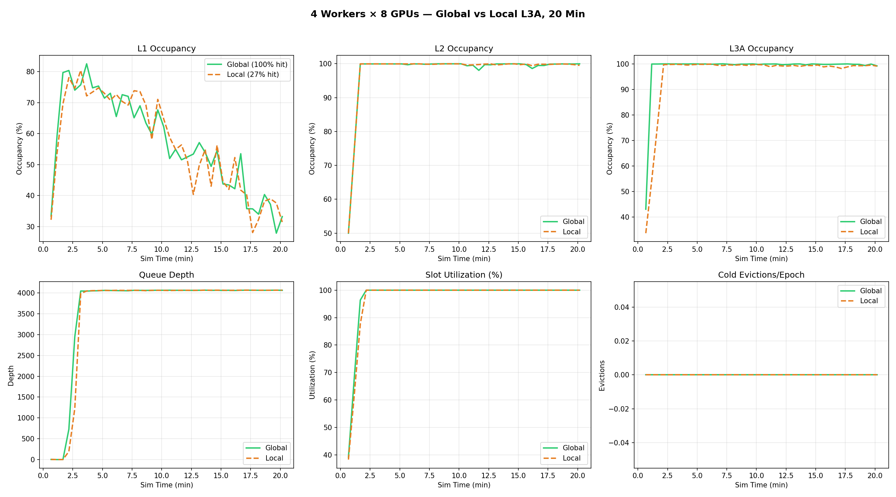

# Heavy Coding Workload Report

**Config**: `configs/heavy_coding.json` | **Simulation**: 20 minutes | **Model**: Llama3-70B FP16 on A100-80GB

## Workload Profile

90% coding workloads reflecting AI coding assistant deployments (Claude Code, Cursor).

| Profile | Mix | System Prefix | Input/Turn | Context Growth | Session Duration |
|---------|-----|---------------|-----------|----------------|-----------------|
| coding | 45% | 20k tokens | 8k tokens | 2-10k/turn | 1 hour |
| agentic_coding | 45% | 30k tokens | 15k tokens | 5-20k/turn | 30 min |
| chat | 5% | 2k tokens | 150 tokens | 100-500/turn | 10 min |
| batch | 3% | 2k tokens | 1.2k tokens | none | 1s |
| agent | 2% | 2k tokens | 400 tokens | 300-1.5k/turn | 30 min |

**KV object sizes** (70B FP16): coding ~8.2 GB, agentic_coding ~15.6 GB, chat ~0.8 GB.

## Hardware

| Tier | Capacity | Bandwidth | Scope |
|------|----------|-----------|-------|
| L1 (HBM) | 80 GB | 3 TB/s | Per-GPU |
| L2 (DRAM) | 1 TB | 64 GB/s | Per-worker (8 GPUs share) |
| L3A (SSD) | 8 TB | 7 GB/s | Per-worker; global mode pools all workers |

Worker topology: 8 GPUs/worker. Global L3A: 4 workers × 8 TB = 32 TB pooled. Local L3A: 8 TB/worker.

---

## 1. Global vs Local L3A

The central finding: **global L3A is essential for multi-worker coding deployments.**

### Hit Rate Over Time (4 workers × 8 GPUs, 20 min)

| Duration | Global L3A | Local L3A | Gap |
|----------|-----------|----------|-----|
| 1 min | 99.91% | 99.91% | 0% |
| 5 min | 99.81% | **55.23%** | **+44.6%** |
| 10 min | 99.73% | **36.74%** | **+63.0%** |
| 20 min | 99.77% | **26.56%** | **+73.2%** |

### Timeline: L2/L3A Occupancy, Queue Depth, Cold Evictions


Both global and local L3A reach 100% occupancy quickly. The difference: with local L3A, cold evictions spike as migrated sessions can't find their KV → queue depth grows from cold-miss recomputes.

### Node Scaling (1-4 workers, 20 min)


| Workers | GPUs | Global Hit | Local Hit | Local Misses |
|---------|------|-----------|----------|-------------|
| 1 | 8 | 99.8% | 99.8% | 1,921 |
| 2 | 16 | 99.8% | **49.3%** | 418,173 |
| 4 | 32 | 99.8% | **26.6%** | 606,005 |

At 1 worker: identical (no cross-worker migration). At 2+ workers: local L3A collapses because sessions migrate and can't find KV on the new worker.

### TTL Sensitivity (4 workers, 20 min)


| L2 TTL | Global Hit | Local Hit |
|--------|-----------|----------|
| 10s | 99.8% | 26.5% |
| 30s | 99.8% | 33.8% |
| 60s | 99.8% | 26.9% |
| 120s | 99.8% | 27.1% |
| 300s | 99.8% | 26.6% |

**TTL has minimal impact** on either mode. Global L3A maintains 99.8% regardless. Local L3A stays at ~27% regardless — the bottleneck is cross-worker accessibility, not object lifetime.

---

## 2. Single Worker Deep Dive (8 GPUs, 20 min)



With a single worker, there's no session migration — all objects stay local. **Hit rate: 99.8%.**

Key observations:
- **L1 occupancy fluctuates** (33-60%) — coding objects are large (8-16 GB) relative to 80 GB L1, so a few objects fill it
- **L2 saturates at 100%** within minutes — 1 TB can't hold the growing working set
- **L3A becomes the primary cache** — most lookups eventually find objects in SSD
- **Slot utilization near 100%** — coding prefills take 14-17s, keeping slots busy
- **Recompute fraction ~31%** — each turn adds 8-15k new tokens (user message + tool output), even with 95% prefix stability
- **TTFT**: L1 hits ~100ms, L3A hits ~1-5s, cold misses ~17s

---

## 3. Multi-Worker Deep Dive (4 workers × 8 GPUs, 20 min)



Global (green) vs Local (orange, dashed) — same hardware, different L3A mode.

Key observations:
- **L1/L2/L3A occupancy identical** — both modes use the same per-worker storage, both saturated (~100% L2/L3A)
- **Queue depth identical** — both modes are equally saturated (~4000 depth, near max). The system is throughput-limited regardless of cache mode
- **Slot utilization identical** — both near 100%. Every slot is busy whether doing a cache-hit prefill or a cold-miss recompute
- **The difference is invisible in infrastructure metrics.** Global and local look identical in occupancy, queue depth, and utilization. The 73pt hit rate gap shows up only in **what each slot computes**: global slots do partial recompute (cache hit, fast), local slots do full recompute (cold miss, 14-17s). Same slot utilization, vastly different useful throughput.

**Why don't the plots show the difference?** Because infrastructure metrics (occupancy, queue depth, slot utilization) measure *resource consumption*, not *useful work*. Both modes consume 100% of slots and fill all queues. The difference is subtle:
- Global: mean prefill 7.5s (mix of cache hits + some long computes)
- Local: mean prefill 7.7s (more cold misses, but cold miss duration varies by profile — small chat misses are fast)
- The 73pt hit rate gap translates to only ~3% prefill duration difference because the workload mix includes lightweight profiles that are fast even as cold misses

The real cost of local L3A is **throughput waste**: 73% of prefill slots are doing unnecessary full recomputes that a global cache hit would have avoided. The slots are equally busy, but local mode does far less useful work per slot-second.

Dispatch stats at 20 min:
- Global: 878 affinity, 824,278 non-affinity (0.1% affinity)
- Local: 194,950 affinity, 630,206 non-affinity (24% affinity)

---

## 4. Session Migration

### Why Sessions Migrate

The push dispatcher routes requests to nodes with cache affinity (session's KV in L1/L2). But:
1. L1 (80 GB/GPU) and L2 (1 TB/worker) saturate within minutes
2. Objects are evicted to L3A via TTL or pressure
3. Once in L3A, the affinity check **no longer detects them** (it only checks L1/L2)
4. The session loses affinity → next request dispatched to any available node
5. At steady state, **97-99% of dispatches are non-affinity**

### Impact

Each migrated request with local L3A is a **cold miss** (14-17s full recompute) because the new worker's SSD doesn't have the KV. With 97% non-affinity dispatch, this means 97% of requests recompute from scratch.

### Mitigations

| Approach | Benefit | Cost |
|----------|---------|------|
| **Global L3A** | 99.8% hit rate, any worker finds any KV | 50ms remote latency (negligible vs 14s compute) |
| **L3A-aware affinity** | Route to worker whose SSD has the KV | Cross-worker L3A lookup at dispatch time |
| **Session pinning** | Avoid migration entirely | Sacrifices load balancing |

---

## 5. Summary

| Finding | Evidence |
|---------|----------|
| **Global L3A is essential** for multi-worker deployments | 99.8% vs 26.6% hit rate at 20 min (73pt gap) |
| **Session migration is the mechanism** | 97% non-affinity dispatch at steady state |
| **Infrastructure metrics don't show the gap** | Queue depth, slot utilization, occupancy are identical for global and local — the difference is in useful work per slot |
| **Prefill compute is the throughput bottleneck** | Mean 7.5s/request, limited by 14-17s coding prefills → ~39 QPS/worker |
| **L1 is critical but temporary** | 98% L1 hits at 1 min, saturates by 5 min |
| **50ms global L3A latency is negligible** | <0.3% overhead on 7.5s mean prefill |
| **TTL has no impact** on global vs local | Both modes insensitive to L2 TTL (10-300s) |
| **Recompute fraction ~31% is structural** | Driven by 8-15k new input tokens/turn, not instability |

## Reproduction

```bash
# Generate all 20-min analysis plots
python scripts/heavy_coding_analysis.py

# Quick comparison (programmatic)
from sim.config import SimConfig
from sim.engine import SimEngine
config = SimConfig.from_json("configs/heavy_coding.json")
config.sim_duration_s = 1200.0  # 20 min
config.warmup_s = 10.0
config.sim_start_time_s = 36000.0
config.service.n_prefill_nodes = 32  # 4 workers × 8 GPUs
config.service.n_gpus_per_worker = 8
config.service.l3a_shared = True  # or False for local
metrics = SimEngine(config).run()
print(metrics.report())
```
