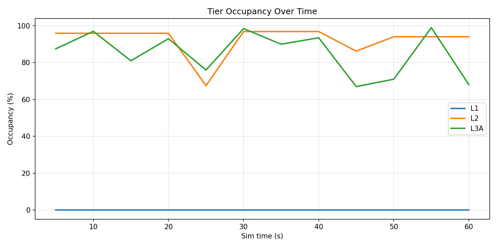
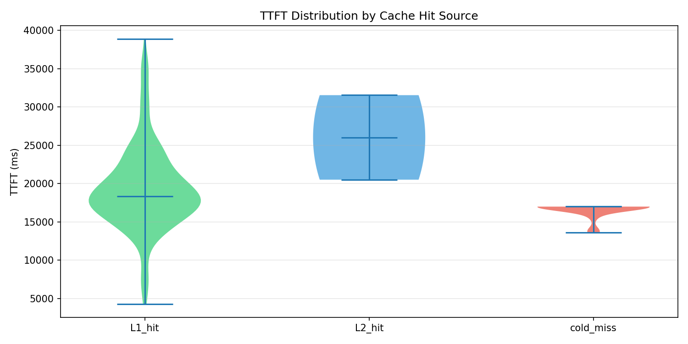
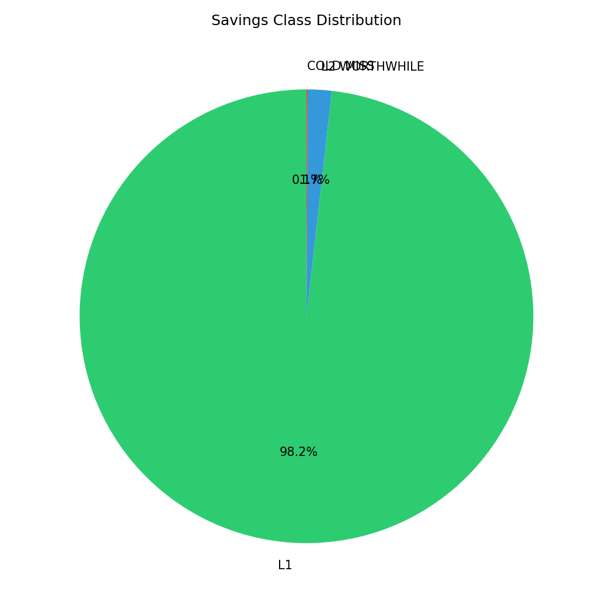
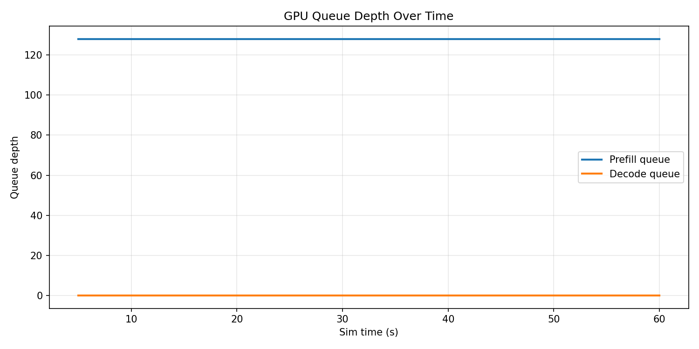
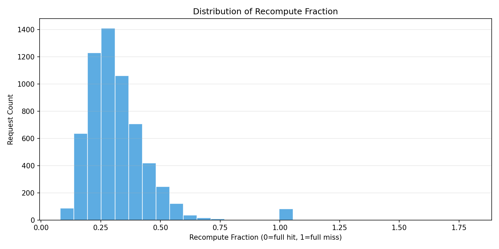
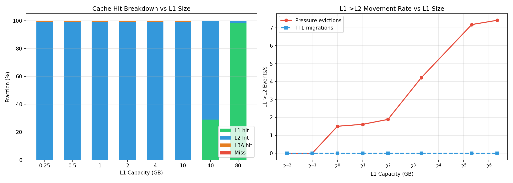
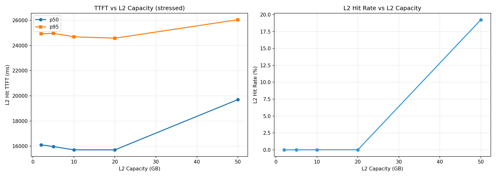
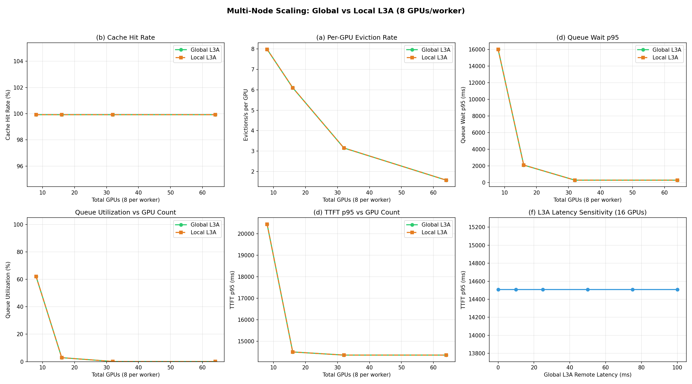
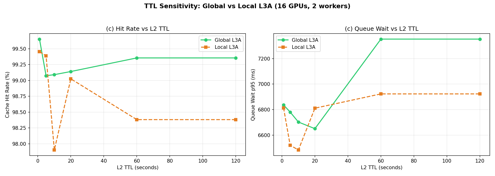
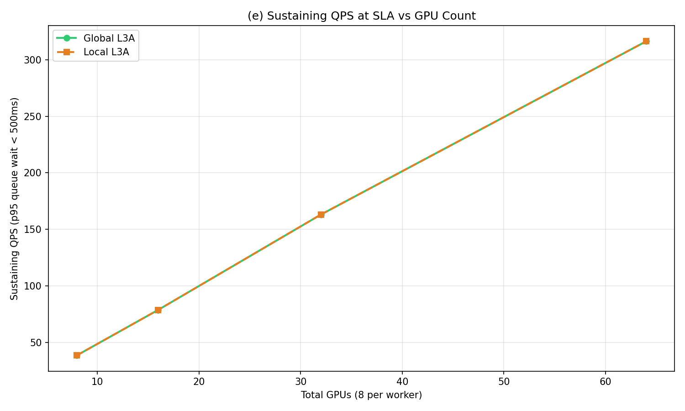

# Heavy Coding Workload Report

**Config**: `configs/heavy_coding.json`
**Date**: 2026-03-21
**Model**: Llama3-70B FP16 on A100-80GB

## Workload Profile

90% of traffic is coding workloads (coding + agentic_coding), reflecting a deployment heavily weighted toward AI coding assistants like Claude Code and Cursor.

| Profile | Mix Weight | System Prefix | Input/Turn | Context Growth | Session Duration |
|---------|-----------|---------------|-----------|----------------|-----------------|
| coding | 45% | 20,000 tokens | 8,000 tokens | 2-10k/turn | 1 hour |
| agentic_coding | 45% | 30,000 tokens | 15,000 tokens | 5-20k/turn | 30 min |
| chat | 5% | 2,048 tokens | 150 tokens | 100-500/turn | 10 min |
| batch | 3% | 2,048 tokens | 1,200 tokens | none | 1s |
| agent | 2% | 2,048 tokens | 400 tokens | 300-1.5k/turn | 30 min |

**KV object sizes** (70B FP16 at 327,680 bytes/token):
- Coding session (26k tokens avg): ~8.2 GB
- Agentic coding session (50k tokens avg): ~15.6 GB
- Chat session (2.6k tokens avg): ~0.8 GB

## Hardware Configuration

| Tier | Capacity | Bandwidth | Block Size | Scope |
|------|----------|-----------|-----------|-------|
| L1 (HBM) | 80 GB | 3 TB/s | 5 KB | Per-GPU |
| L2 (DRAM) | 1 TB | 64 GB/s | 32 MB | Per-worker (shared by 8 GPUs) |
| L3A (SSD) | 8 TB | 7 GB/s | 256 MB | Per-worker SSD; global mode pools all workers |

**Worker topology**: 8 GPUs per worker (H100 DGX-class).

**Service**: 32 prefill slots/GPU, 256 decode slots shared, 128 prefill queue max/GPU.

## Single Worker Results (8 GPUs, realistic hardware)

```
Sharing factor:  1.866
Hit rates:       L1=98.2%  L2=0.83%  L3A=0.88%  miss=0.08%
Tier saturation: L1=91.8%  L2=75.5%  L3A=9.9%
L1->L2 pressure:   7.4/s
Cold evictions:    0
```

Key observations:
- **98.2% L1 hits** — 80GB L1 holds ~4-10 coding KV objects. Most lookups find cached KV in HBM.
- **L2 acts as overflow** at 75.5% saturation — 0.83% of lookups fall through to L2 (DRAM).
- **L3A catches L2 overflow** — 0.88% of lookups hit L3A. Objects that can't fit in L2 are hibernated to SSD.
- **0.08% cold miss** — near-perfect cache performance.
- **L1 saturation 91.8%** — L1 is well-utilized but not overflowing excessively.

### Plot: Tier Occupancy Over Time


L1 fills to ~92% and stays there. L2 absorbs overflow at ~75%. L3A catches objects that overflow L2 (~10%).

### Plot: TTFT Distribution


L1 hits dominate with low TTFT. The small number of cold misses show a long tail (~17s for full 60k-token recompute).

### Plot: Savings Class Distribution


L1 hits dominate — HBM is fast enough to hold the working set for a 60s sim.

### Plot: Queue Depth


Prefill queue pressure from coding workloads' long compute times.

### Plot: Recompute Fraction


Most requests recompute only 5-20% of context (high prefix stability from coding sessions).

## Sensitivity Analysis

### L1 Capacity Sensitivity


L1 hit rate appears only above ~10 GB. Below that, coding KV objects (8-16 GB) don't fit. At 80 GB, L1 absorbs most of the working set.

### L2 Capacity Sensitivity


L2 hit rate vs capacity sweep. With realistic L1 (80GB), L2 is mainly used for overflow — less sensitive than in stressed configs.

## Multi-Node Scaling: Global vs Local L3A

### Node Scaling (1-8 workers × 8 GPUs)


| Workers | GPUs | Global L3A Total | Local L3A/Worker | Global Hit | Local Hit |
|---------|------|-----------------|-----------------|-----------|----------|
| 1 | 8 | 8 TB | 8 TB | 99.9% | 99.9% |
| 2 | 16 | 16 TB | 8 TB | 99.9% | 99.9% |
| 4 | 32 | 32 TB | 8 TB | 99.9% | 99.9% |
| 8 | 64 | 64 TB | 8 TB | 99.9% | 99.9% |

**At realistic hardware scale, global and local L3A are identical.** With 8TB SSD per worker, even local L3A has more than enough capacity for the workload in a 60s sim. The global L3A advantage only appears when per-worker SSD is small relative to total KV working set — see the stressed config analysis below.

**L3A Latency Sensitivity** (panel f): TTFT is completely flat across 0-100ms remote latency because L3A is unused — all hits come from L1/L2.

### TTL Sensitivity (2 workers × 8 GPUs)


Hit rate is 99.9% regardless of TTL. Shorter L2 TTLs increase queue wait (objects move to L3A sooner → slower restore), but the effect is small.

### Sustaining QPS at SLA (p95 queue wait < 500ms)


| Workers | GPUs | Global QPS | Local QPS |
|---------|------|-----------|-----------|
| 1 | 8 | 44 | 44 |
| 2 | 16 | 79 | 79 |
| 4 | 32 | 171 | 171 |
| 8 | 64 | 332 | 332 |

Scales linearly. Global and local identical — cache is never the bottleneck at realistic hardware scale. **QPS is limited by prefill compute (~14-17s for large coding contexts), not by cache capacity.**

## Simulation Duration Sensitivity

The 60s simulation has **not reached steady state**. Longer sims show increasing tier pressure as multi-turn coding sessions accumulate context:

| Duration | L1 Sat. | L2 Sat. | L3A Sat. | Miss Rate | Events |
|----------|---------|---------|----------|-----------|--------|
| 60s | 91.8% | 75.5% | 9.9% | 0.08% | 6,054 |
| 120s | 86.3% | 87.8% | 36.2% | 0.14% | 15,784 |

At 120s, L2 saturation rises from 75% to 88%, L3A from 10% to 36%, and miss rate nearly doubles. This is because coding sessions (`iat_mean=360s`) get more turns in longer sims, growing their context and producing larger KV objects. A production deployment running for hours would see significantly more L2/L3A pressure and potentially higher miss rates — the global vs local L3A distinction would become more significant at scale.

## Recompute Fraction Analysis

The recompute fraction (mean=31%, p50=29%) may seem high given 98.2% cache hit rate. These metrics measure different things:

- **Cache hit rate**: was a cached KV object found? (binary per request)
- **Recompute fraction**: what fraction of total tokens must be recomputed? (per request)

Even with a cache hit at 95% prefix stability, the recompute fraction is significant because **new input tokens are always uncached**:

```
Total context: ~30k tokens (stable prefix)
Cached tokens: 30k × 0.95 = 28.5k
Uncached from instability: 30k × 0.05 = 1.5k
New input tokens (user message + tool output): 8-15k (always uncached)
Total uncached: 9.5-16.5k
Recompute fraction: 9.5k / 38k = 25% (coding) to 16.5k / 46.5k = 35% (agentic_coding)
```

This is realistic — in Claude Code, each turn adds 8-15k new tokens (tool output, user message) out of a 40-60k total prompt, so 20-35% is new each turn. The cache saves recomputation of the other 65-80%.

## Global vs Local L3A: The Critical Finding

### Tier Saturation Over Time

Longer sims confirm the tiers saturate over time (4 workers × 8 GPUs, realistic hardware):

| Duration | L2 Occupancy | L3A Occupancy | L2→L3A Migrations | Cold Evictions | Miss Rate |
|----------|-------------|---------------|-------------------|---------------|-----------|
| 1 min | 75% | 100% | 0 | 0 | 0.09% |
| 5 min | 100% | 100% | 0 | 25 | 0.19% |
| 10 min | 100% | 100% | 688 | 1,537 | 0.27% |
| 20 min | 100% | 99% | 1,409 | 20,613 | 0.23% |

L2 saturates at 5 min, L3A is saturated from the start (objects skip L2 when it's full). By 20 min, 20k cold evictions occur — L3A is churning objects at 93× its capacity.

At longer durations, **global L3A dramatically outperforms local** due to session migration:

| Duration | Global Hit | Local Hit | Gap | Local Misses |
|----------|-----------|----------|-----|-------------|
| 1 min | 99.91% | 99.91% | 0% | 5 |
| 5 min | 99.81% | **55.23%** | **+44.6%** | 30,078 |
| 10 min | 99.73% | **36.74%** | **+63.0%** | 146,820 |
| 20 min | 99.77% | **26.56%** | **+73.2%** | 606,005 |

### Why the Gap Appears

**97% of dispatches are non-affinity** — sessions constantly migrate between workers. The push dispatcher's affinity check only looks at L1/L2. Once objects move to L3A (which happens as L1/L2 fill), the session loses affinity and gets dispatched to any available node.

With **global L3A**: the migrated session finds its KV in the shared pool → cache hit.
With **local L3A**: the new worker's SSD doesn't have the KV → cold miss → full 14-17s recompute.

At 20 min, 97% non-affinity dispatch × local L3A = 606k cold misses (26.6% hit rate). Global L3A maintains 99.8% because the pooled storage is accessible from any worker.

### Why 1-Min Sim Shows No Difference

At 1 min, L1 (80 GB per GPU) and L2 (1 TB per worker) haven't filled yet. Objects stay in L1/L2, affinity checks find them, and sessions don't migrate. The effect requires enough time for objects to be evicted from L1/L2 to L3A, after which affinity is lost.

### Implications for Production

- **Global L3A is essential for multi-worker deployments.** With realistic coding workloads, sessions migrate between workers within minutes. Local L3A drops to 27% hit rate at 20 min.
- **The bottleneck is affinity, not capacity.** Both global (32 TB) and local (8 TB/worker) have enough SSD. The difference is accessibility — global lets any worker find any session's KV.
- **Affinity dispatch helps but doesn't solve it.** Affinity only checks L1/L2. Once objects reach L3A, affinity is lost. Extending affinity to include L3A would improve local mode but add cross-worker lookup overhead.
- **Short sims (1 min) are misleading.** The gap only appears after L1/L2 fill and objects migrate to L3A (5+ min).

## Key Findings

1. **Realistic hardware absorbs coding workloads well.** 80GB L1 + 1TB L2 + 8TB L3A per worker provides 99.9% hit rate in a 60s sim. Cache capacity is not the bottleneck at this scale.

2. **Prefill compute is the bottleneck.** 60k-token coding contexts require ~14-17s of GPU compute. This limits sustaining QPS to ~39-44/worker regardless of cache configuration.

3. **60s sim has not reached steady state.** At 120s, L2 saturation rises to 88% and miss rate doubles. Production deployments running for hours would see significantly more tier pressure — global vs local L3A differences would become more significant.

4. **Global L3A is critical for multi-worker deployments.** At 20 min, global=99.8% vs local=26.6% hit rate. Sessions migrate between workers (97% non-affinity dispatch after L1/L2 evict to L3A), and local L3A can't serve migrated sessions. Global L3A pools all workers' SSDs.

5. **L1 is the critical tier in short sims.** 98.2% of lookups hit L1 (HBM) at 1 min. But L1 saturates quickly, and at 5+ min the working set overflows to L2/L3A where the global vs local distinction matters.

6. **Recompute fraction (~31%) is driven by new input tokens, not prefix instability.** Even with 95% prefix stability, each coding turn adds 8-15k new tokens (user message + tool output), creating a 25-35% recompute fraction. This is consistent with real-world Claude Code usage.

7. **High prefix stability** (95% initial, 80-85% final) means 65-80% of tokens per turn are served from cache. The 20-30k shared system prefix is reused across all turns in a session.

## Reproduction

```bash
# Generate all plots with heavy coding config
python scripts/sanity_plots.py --config configs/heavy_coding.json --outdir plots/heavy_coding

# Run programmatically
from sim.config import SimConfig
from sim.engine import SimEngine
config = SimConfig.from_json("configs/heavy_coding.json")
config.sim_duration_s = 60.0
config.warmup_s = 5.0
config.sim_start_time_s = 36000.0
metrics = SimEngine(config).run()
print(metrics.report())
```
